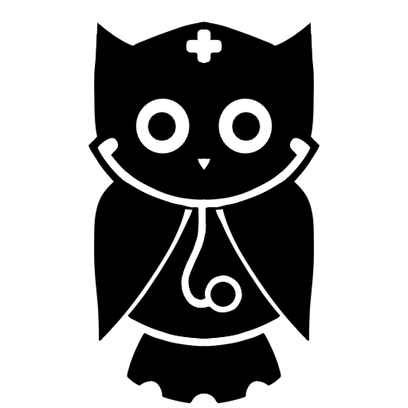

<div align="center">
    <a href="https://github.com/BlackKing72/api-owlpost"  style="filter: drop-shadow(0 0 1px #fafaff80)">
        
</a>
    <h3 align="center">Owlpost</h3>
    <p align="center">
        Uma plataforma colaborativa onde estudantes podem compartilhar <br> conteúdos e tópicos de interesse da turma.
    </p>
</div>
<br/>

<div align="center">
    
</div>
<br/>
<br/>

O Objetivo da plataforma é ajudar os usuários a encontrarem o conteúdo que desejam estudar, sem precisar procurar em diversos sites ou ler livros inteiros para retirar pequenos trechos de conteúdo.

Foi criado usando [React][react-url] + [Vite][vite-url] e algumas bibliotecas para facilitar o desenvolvimento.

Este projeto foi criado como parte de um trabalho escolar, [Projeto Integrador (P.I)](#sobre-o-projeto-integrador), com o objetivo de demonstrar habilidades adquiridas no decorrer das unidades curriculares.

<br/>
<div align="center">
    
    
    <br/>
    
    
</div>
<br/>

<br/>

## Como funciona

Os usuários podem criar, ler e interagir com as postagens. A plataforma oferece um editor de Markdown para que os usuários possam criar conteúdos com links, imagens e vídeos.

A plataforma também funciona como forma de acesso para o minigame ([Owlcalc](https://github.com/BlackKing72/owlcalc])).

<br/>

## Tecnologias utilizadas

[![React][react-shield]][react-url] 
[![Vite][vite-shield]][vite-url]
[![JavaScript][js-shield]][js-url]
[![Bootstrap][bs-shield]][bs-url]  
[![FontAwesome][fa-shield]][fa-url]
[![Axios][axios-shield]][axios-url]
[![GSAP][gsap-shield]][gsap-url]
[![Lenis][lenis-shield]][lenis-url]
[![i18next][i18-shield]][i18-url]

<br/>

## Melhorias futuras

- Melhorar a integração com a API.
- Implemetar autenticação usando soluções prontas como [Clerk](https://clerk.com/) ou [Auth0](https://auth0.com/)
- Adicionar a opção de deletar o usuário.
- Adicionar mais ferramentas no editor para facilitar a adição de images, vídeos, etc.
- Otimizar a experiência do editor no mobile.

<br/>

## Autores

[![Matheus Senna][matheus-shield]][matheus-url]
[![Michaell Senna][michaell-shield]][michaell-url]
[![Jonatas Tavares][jonatas-shield]][jonatas-url]  
[![Luis Ricardo][ricardo-shield]][ricardo-url]
[![Vinicius Lima][vinicius-shield]][vinicius-url]

<br/>

## Como rodar o projeto

1. Clone o repositório:
```sh
git clone https://github.com/BlackKing72/owlcalc/
```

2. Acesse a pasta do projeto:
```sh
cd owlcalc
```

3. Instale as dependências:
```sh
npm install
```

5. Inicie o servidor:
```sh
npm run dev
```

<br/>

## Sobre o Projeto Integrador

O P.I tem como objetivo resolver problemas reais utilizando habilidades adquiridas durante as unidades curriculares, incluindo hardware, redes de computadores e desenvolvimento de software.

O nosso projeto foi baseado em um desafio enfrentado pelas turmas de enfermagem, conteúdos teóricos que tornavam o aprendizado difícil e pouco interativo.

Nossa solução foi divida em duas partes:

### Owlpost

Como as turmas de enfermagem já tinham o costume de compartilharem conteúdos entre si, pensamos em algo que poderia facilitar isso. Uma plataforma colaborativa onde os estudantes podem compartilhar conteúdos relacionados às suas matérias e outros tópicos de interesse da turma.

### Owlcalc

Uma das maiores demandas das turmas de enfermagem. Um minigame educativo para ajudar os estudantes de enfermagem à resolverem os cálculos de medicamento e gotejamento de soro de forma prática e interativa.


[react-shield]: https://img.shields.io/badge/React-404040?style=for-the-badge&logo=react
[react-url]: https://react.dev/

[vite-shield]: https://img.shields.io/badge/Vite-404040?style=for-the-badge&logo=vite
[vite-url]: https://vite.dev/

[js-shield]: https://img.shields.io/badge/JavaScript-404040?style=for-the-badge&logo=javascript
[js-url]: https://developer.mozilla.org/en-US/docs/Web/JavaScript

[bs-shield]: https://img.shields.io/badge/Bootstrap-404040?style=for-the-badge&logo=bootstrap
[bs-url]: https://getbootstrap.com/

[axios-shield]: https://img.shields.io/badge/Axios-404040?style=for-the-badge&logo=axios
[axios-url]: https://axios-http.com/

[fa-shield]: https://img.shields.io/badge/Font_Awesome-404040?style=for-the-badge&logo=fontawesome
[fa-url]: https://fontawesome.com/icons

[gsap-shield]: https://img.shields.io/badge/GSAP-404040?style=for-the-badge&logo=data:image/svg+xml;base64,PHN2ZyB4bWxucz0iaHR0cDovL3d3dy53My5vcmcvMjAwMC9zdmciIHhtbG5zOnhsaW5rPSJodHRwOi8vd3d3LnczLm9yZy8xOTk5L3hsaW5rIiBmaWxsPSJub25lIiB2aWV3Qm94PSIwIDAgMjQ4IDI0OCIgYXJpYS1oaWRkZW49InRydWUiIHN0eWxlPSJ0b3VjaC1hY3Rpb246bm9uZSI+PHBhdGggZmlsbD0idXJsKCNhKSIgZmlsbC1ydWxlPSJldmVub2RkIiBkPSJNNjIgMTI0Yy0zNC4yNDIgMC02MiAyNy43NTktNjIgNjJzMjcuNzU5IDYyIDYyIDYyIDYyLTI3Ljc1OCA2Mi02MmMwIDM0LjI0MiAyNy43NTggNjIgNjIgNjJzNjItMjcuNzU4IDYyLTYyYzAtMzQuMjQxLTI3Ljc1OC02Mi02Mi02MiAzNC4yNDIgMCA2Mi0yNy43NTggNjItNjIgMC0zNC4yNDEtMjcuNzU4LTYyLTYyLTYycy02MiAyNy43NTktNjIgNjJjMC0zNC4yNC0yNy43NTgtNjItNjItNjJTMCAyNy43NiAwIDYyYzAgMzQuMjQyIDI3Ljc1OSA2MiA2MiA2MiIgY2xpcC1ydWxlPSJldmVub2RkIiBzdHlsZT0idG91Y2gtYWN0aW9uOm5vbmUiLz48cGF0aCBmaWxsPSJ1cmwoI2IpIiBmaWxsLXJ1bGU9ImV2ZW5vZGQiIGQ9Ik02MiAxMjRjLTM0LjI0MiAwLTYyIDI3Ljc1OS02MiA2MnMyNy43NTkgNjIgNjIgNjIgNjItMjcuNzU4IDYyLTYyYzAgMzQuMjQyIDI3Ljc1OCA2MiA2MiA2MnM2Mi0yNy43NTggNjItNjJjMC0zNC4yNDEtMjcuNzU4LTYyLTYyLTYyIDM0LjI0MiAwIDYyLTI3Ljc1OCA2Mi02MiAwLTM0LjI0MS0yNy43NTgtNjItNjItNjJzLTYyIDI3Ljc1OS02MiA2MmMwLTM0LjI0LTI3Ljc1OC02Mi02Mi02MlMwIDI3Ljc2IDAgNjJjMCAzNC4yNDIgMjcuNzU5IDYyIDYyIDYyIiBjbGlwLXJ1bGU9ImV2ZW5vZGQiIHN0eWxlPSJtaXgtYmxlbmQtbW9kZTptdWx0aXBseTt0b3VjaC1hY3Rpb246bm9uZSIvPjxkZWZzIHN0eWxlPSJ0b3VjaC1hY3Rpb246bm9uZSI+PHJhZGlhbEdyYWRpZW50IGlkPSJhIiBjeD0iMCIgY3k9IjAiIHI9IjEiIGdyYWRpZW50VHJhbnNmb3JtPSJyb3RhdGUoLTQ4LjI4OSAxOTUuNzY4IDg3Ljc1NClzY2FsZSgyMzUuMTAzIDE1Ny4wNCkiIGdyYWRpZW50VW5pdHM9InVzZXJTcGFjZU9uVXNlIiBzdHlsZT0idG91Y2gtYWN0aW9uOm5vbmUiPjxzdG9wIHN0b3AtY29sb3I9IiNGRkQ5QjAiIHN0eWxlPSJ0b3VjaC1hY3Rpb246bm9uZSIvPjxzdG9wIG9mZnNldD0iLjgwNyIgc3RvcC1jb2xvcj0iI0ZEOUYzQiIgc3R5bGU9InRvdWNoLWFjdGlvbjpub25lIi8+PHN0b3Agb2Zmc2V0PSIxIiBzdG9wLWNvbG9yPSIjRkY4NzA5IiBzdHlsZT0idG91Y2gtYWN0aW9uOm5vbmUiLz48L3JhZGlhbEdyYWRpZW50PjxwYXR0ZXJuIGlkPSJiIiB3aWR0aD0iLjQwMyIgaGVpZ2h0PSIuNDAzIiBwYXR0ZXJuQ29udGVudFVuaXRzPSJvYmplY3RCb3VuZGluZ0JveCIgc3R5bGU9InRvdWNoLWFjdGlvbjpub25lIj48dXNlIHhsaW5rOmhyZWY9IiNzdmctbm9pc2UiIHRyYW5zZm9ybT0ic2NhbGUoLjAwMDgpIiBzdHlsZT0idG91Y2gtYWN0aW9uOm5vbmUiLz48L3BhdHRlcm4+PC9kZWZzPjwvc3ZnPiAg
[gsap-url]: https://gsap.com/

[lenis-shield]: https://img.shields.io/badge/Lenis-404040?style=for-the-badge&logo=data:image/png;base64,iVBORw0KGgoAAAANSUhEUgAAACAAAAAgCAIAAAD8GO2jAAACGklEQVR4nIyWoa6UMRCFv5bfEAIOgyA8ArnBoFBoJI8BCsM7EF4DxVPgERcDNyQIDAkCcwXiL2GXHU7nzL+7FZvu3+mZc6bTmS6XFKPB2E2G/B27CYeJ/jJ/iTGgH0FndoPNEZfrBtHsIMgq0yFYCGV12cVS2SzOpVVEYklx/e8JBSnuzJMUnzZ/GdUq6iAtjwq6VUDD5nokS3I4bE+S75Z6JM1ETwqGwWEiwk3bXtWx6PKoclT5JlC9H+6vhYNRSYuP7+HtvPkG3IULeA4PKqEtKUiBTjfzI/w0lB/wCd7BG3hisqYsGtUFUdMv1dJ+/IbXcC3c0+Svg2aIarTC1bYD4Bd8sO1xNv9qUTPoOO3vQnBrXAkhze/mN3mVtf3kSHxiXAtrH/8duAjg8xkObs7kEkgvq3HYnaPg/nwVUpR6WQZC8jkKLo7ewaXt1HUTsc/Cb6fQH8G9GTe5WVJX0/r1daNPqfELo8WB8R6qa89LaXAyPi/hYZU/XRWotJQDR074DryCZwe+2PYYSypPWlBvw+PZOsrcU7gluP6eCMbtcqPVMauJ1dVKQrJMYcgdzbuCNoOyj/pGLc99qw00Q9kquul69nlXTzubUfNyO8RfQAetVNB6+QDx14Nz9+5Umk3FTq1HpWZIHU5hDCkpRFOapodX+ULZYuqVjlTsvGPoZv/uj21vmav3gxQlZ7pWWreeUg3+BAAA//9/L9Ss5aG7YwAAAABJRU5ErkJggg==
[lenis-url]: https://lenis.darkroom.engineering/

[i18-shield]: https://img.shields.io/badge/i18next-404040?style=for-the-badge&logo=i18next
[i18-url]: https://www.i18next.com/

[jonatas-shield]: https://img.shields.io/badge/Jonatas_Tavares-404040?style=for-the-badge&logo=github
[jonatas-url]: https://github.com/JonatasTavares2000

[matheus-shield]: https://img.shields.io/badge/Matheus_Cruz-404040?style=for-the-badge&logo=github
[matheus-url]: https://github.com/BlackKing72

[michaell-shield]: https://img.shields.io/badge/Michaell_Senna-404040?style=for-the-badge&logo=github
[michaell-url]: https://github.com/thug-okami

[ricardo-shield]: https://img.shields.io/badge/Luis_Ricardo-404040?style=for-the-badge&logo=github
[ricardo-url]: https://github.com/ricardo8santana

[vinicius-shield]: https://img.shields.io/badge/Vinicius_Lima-404040?style=for-the-badge&logo=github
[vinicius-url]: https://github.com/Vini724
